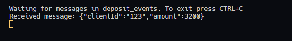

# RabbitMQ Event-Driven Learning Project 🐰🚀

Welcome to my personal RabbitMQ Event-Driven Learning Project This repository is dedicated to my journey of exploring and gaining hands-on experience with event-driven architectures using RabbitMQ.

## Overview

My project aims to deepen my understanding of event-driven systems, especially focusing on asynchronous communication between services facilitated by RabbitMQ. As I navigate through messaging, queues, and system integration, this project is tailored to support my learning objectives.

## What's Inside?

### Practical Examples

Join me on this learning journey with practical examples. These examples guide me through setting up and utilizing RabbitMQ for sending and receiving messages, laying down a solid foundation for my learning path.

### Comprehensive Documentation

Each example comes with detailed documentation. I'm learning about the purpose of the code, how to execute it, and what outcomes to anticipate. My goal is to equip myself with the knowledge and skills needed to navigate the world of RabbitMQ effectively.

## Quick Start Guide

Make sure you have RabbitMQ installed on your machine. Follow these steps to get started:

### Set Up RabbitMQ

Use Docker Compose to easily spin up a RabbitMQ server container.

```shell
cd rabbitmq && docker compose up -d
```

### Deploying the Deposit Server
1. **Open deposit service folder**
   ```shell
   cd deposit-service
   ```

2. **Install Dependencies**

   Choose your package manager:
   
   ```shell
   npm install
   ```
   or
   
   ```shell
   yarn
   ```
   or
   
   ```shell
   pnpm install
   ```

3. **Start the Deposit Service Server**

   ```shell
   npm run dev
   ```
   or
   
   ```shell
   yarn dev
   ```
   or
   
   ```shell
   pnpm run dev
   ```

### Running the Deposit Consumer Example
1. **Open consumers example folder**
   ```shell
   cd consumers
   ```

2. **Install Dependencies**

   Similar to deploying the server, choose your preferred package manager.

3. **Execute the Consumer**

   Listen to deposit events with the following command:

   ```shell
   npm run dev:consumer:deposit
   ```
   or
   
   ```shell
   yarn dev:consumer:deposit
   ```
   or
   
   ```shell
   pnpm run dev:consumer:deposit
   ```

### Triggering a Deposit Event

Interact with the deposit service via an HTTP POST request. Use tools like Postman or Insomnia to send a deposit request to the `/deposit` endpoint:

```json
POST /deposit
{
  "clientId": "client1",
  "amount": 1000
}
```

Monitor the logs of the deposit consumer server to observe the processing of your deposit event.


